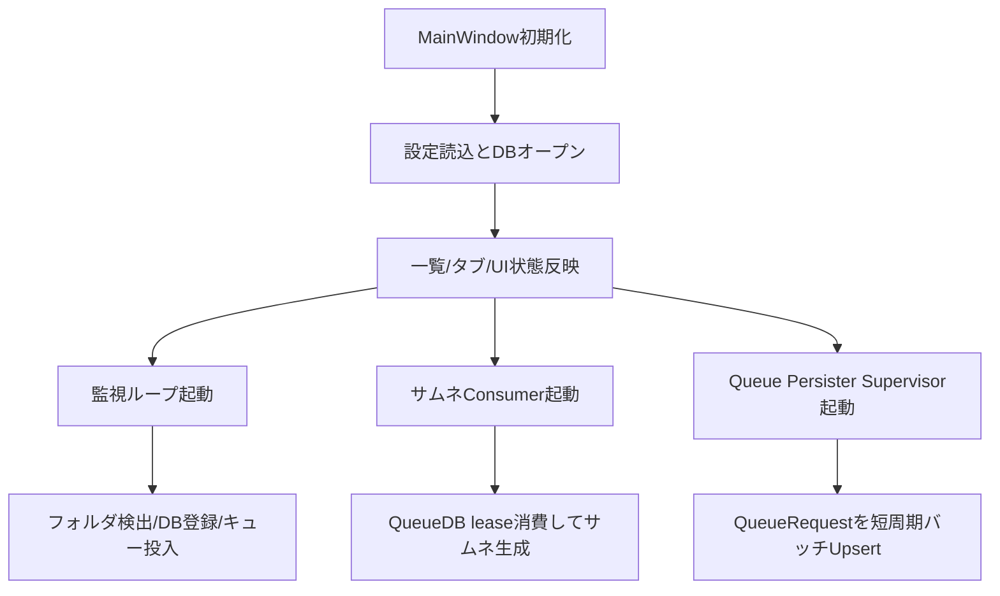

# AI向け 詳細理解書 01: 起動・DB切替・UI初期化

最終更新日: 2026-03-07

## 1. この機能の責務

- アプリ起動直後の初期化
- MainDB情報の読込と画面反映
- バックグラウンド常駐タスク（監視/サムネ/persister）の起動と監督
- DB切替時の混入防止

## 2. 主要ファイル

- `MainWindow.xaml.cs`
- `MainWindow.Selection.cs`
- `MainWindow.Player.cs`
- `MainWindow.Tag.cs`
- `DB/DBInfo.cs`

## 3. 重要ポイント

- `MainWindow` が現時点のオーケストレータ（UI + 実行制御の集約点）。
- サムネイルQueue永続化は Producer/Consumer の間に Persisterを置く構成。
- Persisterは `RunThumbnailQueuePersisterSupervisorAsync` で再起動監視される。
- 監視側スキャンはDBパスをスナップショット化して、処理中のDB切替混入を検知したら中断する。

## 4. 実行順の概略

## 5. 改修ガイド（AI向け）

- 起動処理を触る場合は、必ず「同期処理をUIスレッドに残しすぎていないか」を確認。
- DB切替判定は「比較対象のタイミング」が核心。スナップショット取得位置をずらさない。
- タスク再起動は「二重起動」と「キャンセル漏れ」が事故点。`CancellationTokenSource` の更新順を保つ。
