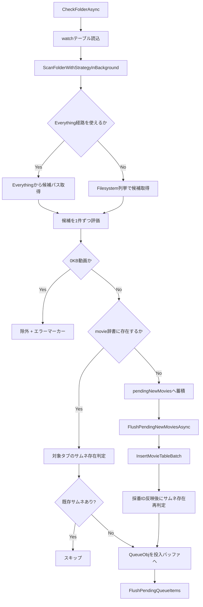

# AI向け 詳細理解書 02: 監視・ファイルサーチ・MainDB登録

最終更新日: 2026-03-07

## 1. この機能の責務

- 監視対象フォルダから動画候補を収集
- 既存DB/既存サムネイルとの突合
- 新規動画のMainDB登録
- サムネイル作成キュー投入

## 2. 主要ファイル

- `Watcher/MainWindow.Watcher.cs`
- `Watcher/IndexProviderFacade.cs`
- `Watcher/EverythingProvider.cs`
- `Watcher/EverythingLiteProvider.cs`
- `DB/SQLite.cs`

## 3. 監視処理の流れ

## 4. MainDB登録の要点

- 1件ごとの即時INSERTではなく、`pendingNewMovies` をまとめてバッチ登録。
- `InsertMovieTableBatch` は1トランザクションでINSERTし、`last_insert_rowid()` を使って採番IDを各MovieCoreへ反映。
- 登録後に `existingMovieByPath` を更新し、同一スキャン中の重複判定を高速化。

## 5. 事故りやすい点

- `existingThumbBodies` と実サムネ存在判定の役割差を混同すると再生成漏れ/過剰再生成が起きる。
- Everything利用可否の判定とフォールバック理由ログを消すと、現場調査が困難になる。
- DB切替中断のガードを緩めると、別DBへの誤登録が発生しうる。
