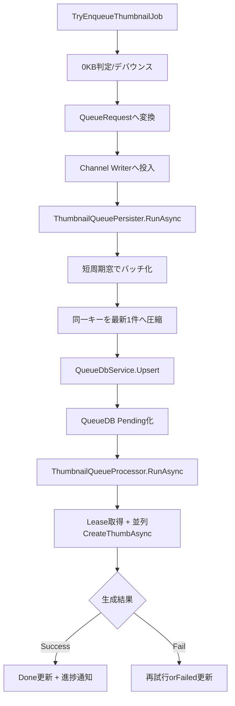

# AI向け 詳細理解書 03: サムネイル作成管理（投入/永続化/消費）

最終更新日: 2026-03-07

## 1. この機能の責務

- 作成対象ジョブの投入（Producer）
- QueueDBへの永続化（Persister）
- QueueDBからのリース取得と生成実行（Consumer）
- 成功/失敗/再試行の状態管理

## 2. 主要ファイル

- `Thumbnail/MainWindow.ThumbnailQueue.cs`
- `src/IndigoMovieManager.Thumbnail.Queue/QueuePipeline/QueueRequest.cs`
- `src/IndigoMovieManager.Thumbnail.Queue/QueuePipeline/ThumbnailQueuePersister.cs`
- `Thumbnail/MainWindow.ThumbnailCreation.cs`
- `src/IndigoMovieManager.Thumbnail.Queue/ThumbnailQueueProcessor.cs`

## 3. 全体パイプライン

## 4. Producer側の設計意図

- 入力停止フラグにより終了シーケンスで新規投入を遮断。
- 0KB動画は早期除外し、エラーマーカーを置いて再投入ループを防止。
- デバウンスは監視イベントの連打吸収が目的。手動操作由来ジョブは抑止対象外。

## 5. Persister側の設計意図

- Channel単一Readerで順序性を保ちつつ、100-300ms窓で書込回数を削減。
- 同一判定キー（`MoviePathKey + TabIndex`）で最新要求のみ残し、無駄なUpsertを抑制。
- Supervisorで再起動可能にし、一時障害でパイプライン全停止しない設計。

## 6. Consumer側の設計意図

- QueueDBリースで多重実行時の取り合いを抑制。
- 並列度は設定値と実行時状況で調整し、詰まりを軽減。
- `CreateThumbAsync` 失敗は例外化し、Queue層で再試行/Failedへ正規遷移させる。
