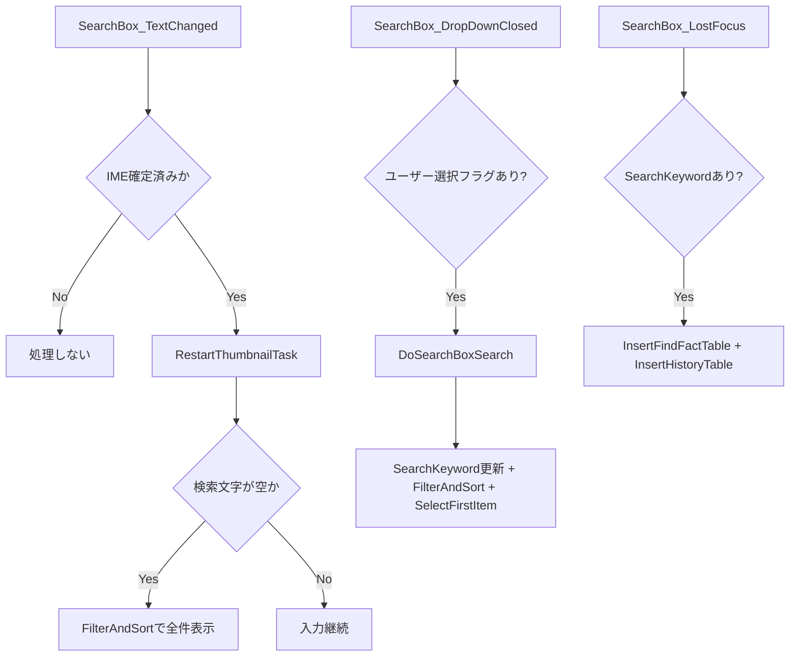

# AI向け 詳細理解書 04: 検索・履歴・画面絞り込み

最終更新日: 2026-03-07

## 1. この機能の責務

- 検索コンボボックスの入力/選択イベント処理
- 履歴（history/find_fact）の更新
- ViewModelへのキーワード反映と絞り込み実行

## 2. 主要ファイル

- `MainWindow.Search.cs`
- `DB/SQLite.cs`
- `ModelViews/MainWindowViewModel.cs`

## 3. イベント駆動フロー

## 4. 挙動上の要点

- 入力中の都度インクリメンタル検索は現状無効化され、空文字時のリセット中心。
- 検索文字変更時に `RestartThumbnailTask` を呼ぶのは、重処理競合を避けるため。
- 履歴DeleteはUI先消し→DB削除非同期の順で応答性を優先。

## 5. AI改修時の注意

- 検索イベントでDBアクセスを追加する場合、UIスレッド滞留を起こしやすい。
- 履歴挿入タイミング（Enter/LostFocus）を変えるとUXとデータ量が大きく変わる。
- `_searchBoxItemSelectedByUser` フラグの意味を崩すと、意図しない検索実行が発生する。
