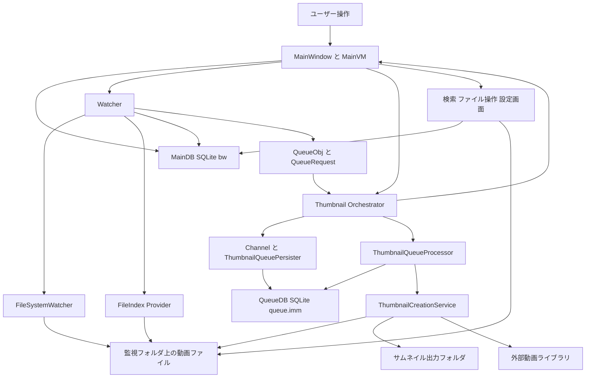

# アプリ全体図: 大まか構成（2026-03-08）

## 1. 目的
- このアプリを大まかに理解したい時に、主要ブロックとデータの流れだけを短時間で掴めるようにする。
- 細かい実装詳細ではなく、どの責務がどこにあるかを俯瞰するための図である。

## 2. この図に含めるもの
- UI と画面オーケストレーション
- MainDB と QueueDB
- Watcher 系
- Thumbnail 系
- 外部ライブラリとファイルシステム

## 3. この図に含めないもの
- 各タブの個別UI詳細
- サムネイル生成エンジンごとの細かなフォールバック順
- 監視フォルダ走査の詳細分岐

## 4. ざっくり構成
- `MainWindow` がアプリの中心で、DBを開き、監視とサムネイル処理の常駐タスクを起動する。
- `Watcher` は監視フォルダとファイルインデックスを見て、新しい動画を MainDB に登録し、必要ならサムネイルジョブを流す。
- `Thumbnail` は QueueDB を介して非同期にサムネイルを生成し、生成結果をUIとMainDBへ反映する。
- `DB/SQLite.cs` は MainDB の読み書きを担当する。
- 外部の動画デコードやファイル検索は、Everything、FFmpeg系、OpenCV系に依存する。

## 5. 大まかな流れ
1. アプリ起動後、`OpenDatafile` が MainDB を開いて一覧を読み込む。
2. `CreateWatcher` と `QueueCheckFolderAsync` で監視と初回走査を始める。
3. `CheckThumbAsync` と `ThumbnailQueuePersister` がサムネイル処理の常駐ループを回す。
4. 新しい動画が見つかると、Watcher が MainDB 登録とサムネイルキュー投入を行う。
5. Thumbnail 系が QueueDB からジョブを取り出してサムネイルを生成する。
6. 完了後は画像保存、UI反映、必要なDB更新を行う。

## 6. 全体図

## 7. ブロックの役割

### 7.1 UI とオーケストレーション
- `MainWindow.xaml`
- `MainWindow.xaml.cs`
- `ModelViews/MainWindowViewModel.cs`
- 役割:
  - 画面表示
  - DBオープン
  - バックグラウンド処理の起動
  - UI反映

### 7.2 Watcher 系
- `Watcher/MainWindow.Watcher.cs`
- `Watcher/EverythingProvider.cs`
- `Watcher/IndexProviderFacade.cs`
- 役割:
  - 監視フォルダの変化検知
  - Everything / USN-MFT / filesystem で候補収集
  - 新規動画の MainDB 登録
  - サムネイルジョブ発行

### 7.3 Thumbnail 系
- `Thumbnail/MainWindow.ThumbnailQueue.cs`
- `Thumbnail/MainWindow.ThumbnailCreation.cs`
- `src/IndigoMovieManager.Thumbnail.Queue/QueuePipeline/ThumbnailQueuePersister.cs`
- `src/IndigoMovieManager.Thumbnail.Queue/ThumbnailQueueProcessor.cs`
- `Thumbnail/ThumbnailCreationService.cs`
- 役割:
  - キュー入力の重複抑止
  - QueueDB 永続化
  - リース付きジョブ実行
  - サムネイル生成
  - 失敗救済

### 7.4 DB
- `DB/SQLite.cs`
- `src/IndigoMovieManager.Thumbnail.Queue/QueueDb/QueueDbService.cs`
- 役割:
  - MainDB の `movie` などを管理
  - QueueDB の `Pending` / `Processing` / `Done` / `Failed` を管理

### 7.5 外部依存
- `Everything`
- `FFMediaToolkit`
- `FFmpeg.AutoGen`
- `OpenCvSharp`
- 役割:
  - ファイル列挙
  - 動画メタ情報取得
  - フレーム抽出
  - サムネイル生成補助

## 8. 主要ファイルの入口
- `MainWindow.xaml.cs`
- `Watcher/MainWindow.Watcher.cs`
- `Thumbnail/MainWindow.ThumbnailQueue.cs`
- `Thumbnail/MainWindow.ThumbnailCreation.cs`
- `Thumbnail/ThumbnailCreationService.cs`
- `DB/SQLite.cs`

## 9. 関連ドキュメント
- [ProjectOverview_2026-02-28.md](/c:/Users/na6ce/source/repos/IndigoMovieManager_fork/Docs/ProjectOverview_2026-02-28.md)
- [Architecture_2026-02-28.md](/c:/Users/na6ce/source/repos/IndigoMovieManager_fork/Docs/Architecture_2026-02-28.md)
- [Flowchart_新動画追加処理_時系列整理_2026-03-08.md](/c:/Users/na6ce/source/repos/IndigoMovieManager_fork/Watcher/Flowchart_新動画追加処理_時系列整理_2026-03-08.md)
- [Flowchart_サムネイル処理ワークフロー_2026-03-08.md](/c:/Users/na6ce/source/repos/IndigoMovieManager_fork/Thumbnail/Flowchart_サムネイル処理ワークフロー_2026-03-08.md)
