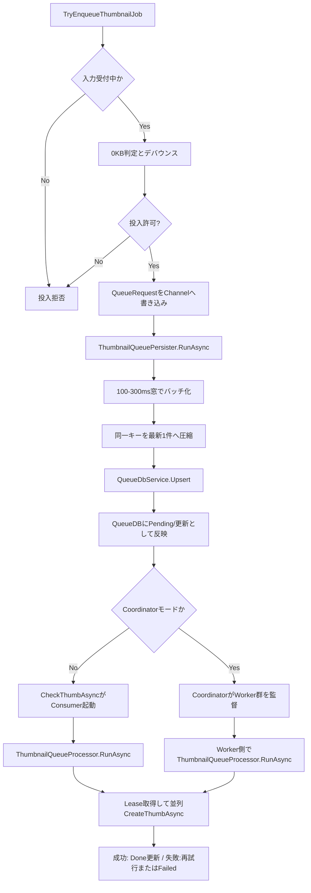

# サムネイル作成管理フロー（把握用）

最終更新日: 2026-03-12

## 1. 目的

本書は、サムネイル作成ジョブの投入・永続化・消費（生成実行）までの管理フローを、運用時の切り分けに使える形で整理した資料です。

## 2. 対象コード

- `Thumbnail/MainWindow.ThumbnailQueue.cs`
  - `TryEnqueueThumbnailJob(...)`
  - `TryWriteQueueRequest(...)`
- `MainWindow.xaml.cs`
  - `RunThumbnailQueuePersisterSupervisorAsync(...)`
- `src/IndigoMovieManager.Thumbnail.Queue/QueuePipeline/ThumbnailQueuePersister.cs`
  - `RunAsync(...)`
  - `PersistBatch(...)`
- `Thumbnail/MainWindow.ThumbnailCreation.cs`
  - `CheckThumbAsync(...)`
  - `CreateThumbAsync(...)`
- `src/IndigoMovieManager.Thumbnail.Queue/ThumbnailQueueProcessor.cs`
  - `RunAsync(...)`
- `src/IndigoMovieManager.Thumbnail.Coordinator/ThumbnailCoordinatorHostService.cs`
  - 外部Worker数決定
  - Worker起動監督

## 3. 全体フロー

## 4. 管理ポイント（実装観点）

1. **投入段階（Producer）**
   - `TryEnqueueThumbnailJob` で 0KB除外、短時間重複（デバウンス）抑制、進捗更新要求を実施。
   - メモリキュー直接処理ではなく、まず `QueueRequest` をChannelへ渡して永続化要求に変換。

2. **永続化段階（Persister）**
   - `ThumbnailQueuePersister` は単一Readerで受信し、短周期窓でバッチ化。
   - `MainDB + MoviePathKey + TabIndex` 単位で重複要求を圧縮し、QueueDBへUpsert。
   - Persister障害は `RunThumbnailQueuePersisterSupervisorAsync` が再起動して継続。

3. **消費段階（Consumer）**
   - 非Coordinator時は `CheckThumbAsync` が `ThumbnailQueueProcessor.RunAsync` を常駐実行。
   - Coordinator時は外部 `Worker` が同じ QueueDB を消費し、本体は運転席監督へ回る。
   - ProcessorはLeaseで取り出したジョブを並列実行し、進捗通知と並列度調整を併用。
   - 実処理 `CreateThumbAsync` は生成失敗を例外化し、Queue層で再試行/Failed管理へ接続。

## 5. 障害切り分けの最短観点

- **投入されない**: `TryEnqueueThumbnailJob` の入力無効・0KB除外・デバウンスを確認。
- **QueueDBに乗らない**: Persisterログ（batch/upsert）とChannel流量を確認。
- **作成が進まない**: ProcessorのLease取得、並列度、Active件数、Failed遷移を確認。
- **作成失敗が多い**: `CreateThumbAsync` の例外理由（出力ファイル未生成、エンジン失敗）を確認。
