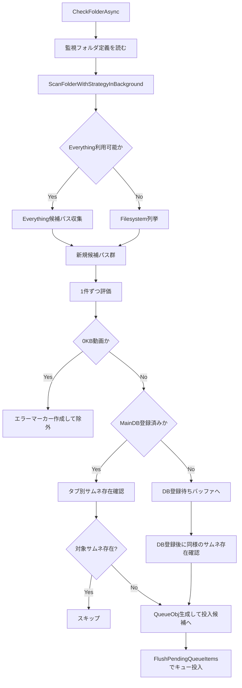

# ファイルサーチと動画サムネイル検出フロー（把握用）

最終更新日: 2026-03-07

## 1. 目的

本書は、監視対象フォルダの探索から「どの動画をサムネイル作成対象にするか」を判定するまでの流れを整理した資料です。

## 2. 対象コード

- `Watcher/MainWindow.Watcher.cs`
  - `CheckFolderAsync(...)`
  - `ScanFolderWithStrategyInBackground(...)`
  - `ScanFolderInBackground(...)`
  - `FlushPendingQueueItems(...)`

## 3. 全体フロー

## 4. 判定ロジックの要点

- 走査戦略は **Everything優先 + Filesystemフォールバック**。
- 候補抽出時点では「ファイル名本体が空でないこと」を主条件にし、過剰な事前除外を避ける。
- 0KB動画はサムネイル作成対象から除外し、再投入ループを防ぐためエラーマーカーを作成。
- MainDB既存動画は `Hash` を使って `"{fileBody}.#{hash}.jpg"` を組み立て、タブ別出力先に実ファイルがあるかで判定。
- 未登録動画はDB登録完了後に同じ存在判定を実施してからキュー投入。

## 5. 運用観点

- 小規模検知では逐次反映（体感優先）、大規模検知ではバッチ投入（スループット優先）の二段構え。
- 監視中にDB切替が発生した場合は安全側で処理を打ち切る。
- Everythingが利用不可でも既存走査で継続するため、機能停止にならない。
