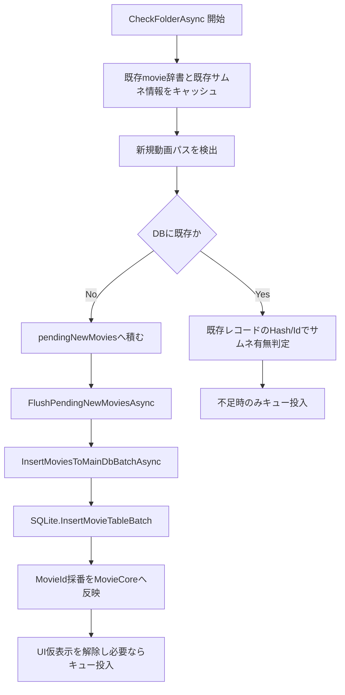

# メインDB登録処理フロー（把握用）

最終更新日: 2026-03-07

## 1. 目的

本書は、監視スキャンで見つかった動画が `movie` テーブルへ登録されるまでの流れを、実装コード基準で追跡できるように整理した資料です。

## 2. 対象コード

- `Watcher/MainWindow.Watcher.cs`
  - `CheckFolderAsync(...)`
  - `FlushPendingNewMoviesAsync(...)`（ローカル関数）
  - `InsertMovieToMainDbAsync(...)`
  - `InsertMoviesToMainDbBatchAsync(...)`
- `DB/SQLite.cs`
  - `InsertMovieTable(...)`
  - `InsertMovieTableBatch(...)`

## 3. 全体フロー

## 4. 実装の流れ（詳細）

1. `CheckFolderAsync` 冒頭で、DB切替混入を防ぐため `DBFullPath` などをスナップショット化します。  
2. 走査前に `movie` テーブルを辞書化して、1件ごとの存在確認SQLを避けます。  
3. 走査で見つかった動画ごとに、DB未登録なら `MovieInfo` を生成し `pendingNewMovies` に蓄積します。  
4. 一定件数到達またはフォルダ走査終了時に `FlushPendingNewMoviesAsync` が呼ばれ、`InsertMoviesToMainDbBatchAsync` を経由して `InsertMovieTableBatch` が実行されます。  
5. `InsertMovieTableBatch` は1トランザクションで複数動画をINSERTし、`last_insert_rowid()` で採番した `MovieId` を `MovieCore` へ戻します。  
6. DB反映後、仮表示（Pending）を解除し、対象タブのサムネイルが無い動画だけをキュー投入します。

## 5. 単体登録経路（補足）

- 監視イベント側の単発処理では `InsertMovieToMainDbAsync` → `InsertMovieTable` が使われます。
- 単体登録でもメタ情報補完（Sinku.dll）とINSERTはトランザクション内で実施されます。

## 6. 重要ポイント

- **重複SQL抑制**: 既存movie辞書キャッシュで、走査中のDB負荷を下げる設計。
- **バッチ登録**: 逐次INSERTを避け、I/O待ち時間を圧縮。
- **DB切替耐性**: スナップショット比較で混入防止。
- **登録後キュー投入**: MovieId/Hash確定後にサムネイル生成へ接続することで、後続処理の整合性を維持。
