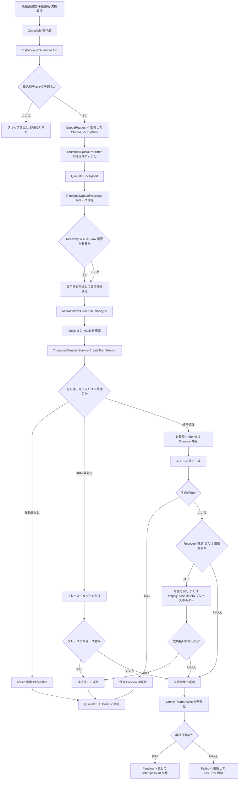

# Flowchart: サムネイル処理ワークフロー（2026-03-08）

## 0. ナビゲーション
- 全体図: `この文書`
- 通常経路: [Flowchart_サムネイル処理ワークフロー_通常経路_2026-03-08.md](./Flowchart_サムネイル処理ワークフロー_通常経路_2026-03-08.md)
- Recovery詳細: [Flowchart_サムネイル処理ワークフロー_Recovery詳細_2026-03-08.md](./Flowchart_サムネイル処理ワークフロー_Recovery詳細_2026-03-08.md)
- 新動画追加側: [Flowchart_新動画追加処理_時系列整理_2026-03-08.md](../Watcher/Flowchart_新動画追加処理_時系列整理_2026-03-08.md)
- 失敗処理詳細: [Flowchart_動画判定処理_失敗時処理_時系列整理_2026-03-08.md](./Flowchart_動画判定処理_失敗時処理_時系列整理_2026-03-08.md)

## 1. 目的
- 現行実装のサムネイル処理を、入力から `Done` / `Pending` / `Failed` 確定まで一枚で追えるように整理する。
- 監視イベント、手動更新、欠損救済から入ったジョブが、QueueDB、生成サービス、失敗救済をどう通るかを把握しやすくする。

## 2. この図に含めるもの
- `QueueObj` 生成後の投入経路
- `TryEnqueueThumbnailJob` の前処理
- `Channel` と `ThumbnailQueuePersister` による QueueDB 永続化
- `ThumbnailQueueProcessor` の実行とレーン判定
- `ThumbnailCreationService` の前処理、生成、救済、状態更新

## 3. この図に含めないもの
- 監視フォルダ走査の細かい差分検出手順
- UI の詳細更新順序
- ベンチ専用経路

## 4. ワークフロー要約

### 4.1 入力から QueueDB まで
1. 新動画追加、既存動画の欠損救済、手動更新などが `QueueObj` を作る。
2. `TryEnqueueThumbnailJob` が入力停止中か、0バイト動画か、短時間重複かを先に判定する。
3. 通過した要求だけ `QueueRequest` へ変換して `Channel` に `TryWrite` する。
4. `ThumbnailQueuePersister` は 100ms から 300ms の窓で要求をまとめる。
5. 同一 `MainDB + MoviePathKey + TabIndex` は最新1件へ圧縮して QueueDB へ `Upsert` する。

### 4.2 QueueDB から生成開始まで
1. `ThumbnailQueueProcessor` が `Pending` または期限切れ `Processing` をリースする。
2. `AttemptCount > 0` のジョブは `Recovery` 属性として扱う。
3. 巨大動画はサイズ閾値で `Slow` レーン扱いにする。
4. 並列数と需要に応じて `Recovery` 枠と `Slow` 枠を予約する。
5. 実ジョブは `MainWindow.CreateThumbAsync` へ渡される。

### 4.3 生成本体
1. `CreateThumbAsync` は `MovieId` と `Hash` を補完する。
2. `ThumbnailCreationService.CreateThumbAsync` がハッシュ、メタキャッシュ、出力先を確定する。
3. 元動画なし、DRM疑い、既知非対応入力は前処理段階で分岐する。
4. `Recovery` かつ修復対象拡張子なら、生成前に `Probe` と一時修復を試す。
5. 動画尺が未取得なら、メタデータ取得後に必要時だけ Shell フォールバックする。
6. その後、エンジン順に生成を試す。

### 4.4 生成失敗時の救済
1. `autogen` の一時エラーはその場で再試行する。
2. `autogen` の黒コマ成功は失敗扱いに直す。
3. `Recovery` 中で破損寄りエラーなら、強制修復後に再実行する。
4. `Recovery` 中で `autogen` が `no frames decoded` などなら、`ffmpeg1pass` を最後の救済として試す。
5. それでも自動生成が失敗した時は、条件次第でプレースホルダー画像へ置き換えて成功扱いにする。
6. 初回のインデックス修復対象だけは、次回 `Recovery` へ送るため失敗を温存する。

### 4.5 確定処理
1. 成功時は保存、必要なUI反映、QueueDB の `Done` 更新を行う。
2. 失敗時は `CreateThumbAsync` が例外化してキュー層へ返す。
3. キュー層は `AttemptCount + 1 < 5` かつ元動画ありなら `Pending` へ戻す。
4. この時だけ `AttemptCount` を加算する。
5. 上限到達または元動画消失時は `Failed` にする。

## 5. フロー図

## 6. 関連ドキュメント
- [Flowchart_新動画追加処理_時系列整理_2026-03-08.md](../Watcher/Flowchart_新動画追加処理_時系列整理_2026-03-08.md)
- [Flowchart_動画判定処理_失敗時処理_時系列整理_2026-03-08.md](./Flowchart_動画判定処理_失敗時処理_時系列整理_2026-03-08.md)
- [Flowchart_動画情報取得_サムネイル作成_ハッシュ作成タイミング_2026-03-04.md](./Flowchart_動画情報取得_サムネイル作成_ハッシュ作成タイミング_2026-03-04.md)

## 7. 主な対応コード
- `Thumbnail/MainWindow.ThumbnailQueue.cs`
- `src/IndigoMovieManager.Thumbnail.Queue/QueuePipeline/ThumbnailQueuePersister.cs`
- `src/IndigoMovieManager.Thumbnail.Queue/QueueDb/QueueDbService.cs`
- `src/IndigoMovieManager.Thumbnail.Queue/ThumbnailQueueProcessor.cs`
- `Thumbnail/MainWindow.ThumbnailCreation.cs`
- `Thumbnail/ThumbnailCreationService.cs`
