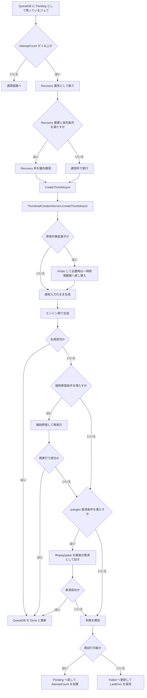

# Flowchart: サムネイル処理ワークフロー Recovery詳細（2026-03-08）

## 0. ナビゲーション
- 全体図: [Flowchart_サムネイル処理ワークフロー_2026-03-08.md](./Flowchart_サムネイル処理ワークフロー_2026-03-08.md)
- 通常経路: [Flowchart_サムネイル処理ワークフロー_通常経路_2026-03-08.md](./Flowchart_サムネイル処理ワークフロー_通常経路_2026-03-08.md)
- Recovery詳細: `この文書`
- 新動画追加側: [Flowchart_新動画追加処理_時系列整理_2026-03-08.md](../Watcher/Flowchart_新動画追加処理_時系列整理_2026-03-08.md)
- 失敗処理詳細: [Flowchart_動画判定処理_失敗時処理_時系列整理_2026-03-08.md](./Flowchart_動画判定処理_失敗時処理_時系列整理_2026-03-08.md)

## 1. 目的
- `AttemptCount > 0` の再試行ジョブが、どう `Recovery` として扱われ、どこで修復や再試行が入るかを詳細に整理する。
- 通常経路ではなく、失敗後の救済と `Pending` / `Failed` 確定に焦点を当てる。

## 2. この図に含めるもの
- `Recovery` 判定
- `Recovery` 枠の優先確保
- 生成前 `Probe` とインデックス修復
- 生成失敗後の強制修復と `ffmpeg1pass` 救済
- `Pending` / `Failed` 更新

## 3. この図に含めないもの
- 監視フォルダ側の新規動画検出詳細
- UI の詳細更新
- 通常成功経路の細かな保存処理

## 4. Recovery詳細の要約
1. QueueDB で `AttemptCount > 0` のジョブは `Recovery` として扱う。
2. 並列数と需要条件を満たす時は、`Recovery` 枠を先に1件確保する。
3. `CreateThumbAsync` 開始後、`Recovery` かつ修復対象拡張子なら `Probe` して一時修復動画へ差し替えることがある。
4. 通常のエンジン順で失敗した後も、エラー内容次第で強制修復と再実行を試す。
5. `autogen` の `no frames decoded` や黒コマ失敗は、`ffmpeg1pass` を最後の救済候補にする。
6. それでも失敗した時は、再試行可能なら `Pending` へ戻し、上限到達なら `Failed` にする。

## 5. フロー図

## 6. 補足ポイント
- `Recovery` はサイズレーンではなく、失敗済みジョブに付く再試行属性である。
- 初回のインデックス修復対象動画は、プレースホルダー成功で握り潰さず次回 `Recovery` へ送る設計がある。
- `Failed` 判定は `AttemptCount + 1 >= 5` ベースだが、`Failed` 更新時に `AttemptCount` 自体は増やさない。

## 7. 関連ドキュメント
- [Flowchart_サムネイル処理ワークフロー_2026-03-08.md](./Flowchart_サムネイル処理ワークフロー_2026-03-08.md)
- [Flowchart_動画判定処理_失敗時処理_時系列整理_2026-03-08.md](./Flowchart_動画判定処理_失敗時処理_時系列整理_2026-03-08.md)

## 8. 主な対応コード
- `src/IndigoMovieManager.Thumbnail.Queue/ThumbnailQueueProcessor.cs`
- `src/IndigoMovieManager.Thumbnail.Queue/QueueDb/QueueDbService.cs`
- `Thumbnail/MainWindow.ThumbnailCreation.cs`
- `Thumbnail/ThumbnailCreationService.cs`
