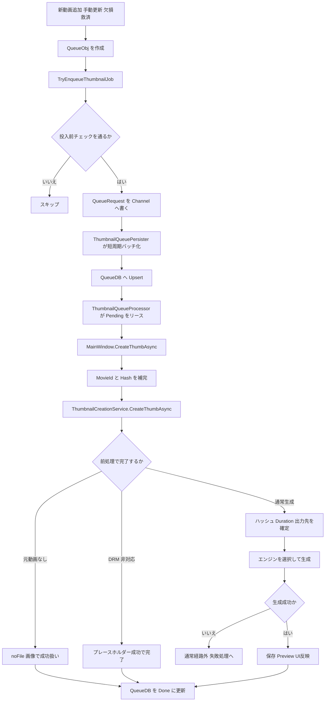

# Flowchart: サムネイル処理ワークフロー 通常経路（2026-03-08）

## 0. ナビゲーション
- 全体図: [Flowchart_サムネイル処理ワークフロー_2026-03-08.md](/c:/Users/na6ce/source/repos/IndigoMovieManager_fork/Thumbnail/Flowchart_サムネイル処理ワークフロー_2026-03-08.md)
- 通常経路: `この文書`
- Recovery詳細: [Flowchart_サムネイル処理ワークフロー_Recovery詳細_2026-03-08.md](/c:/Users/na6ce/source/repos/IndigoMovieManager_fork/Thumbnail/Flowchart_サムネイル処理ワークフロー_Recovery詳細_2026-03-08.md)
- 新動画追加側: [Flowchart_新動画追加処理_時系列整理_2026-03-08.md](/c:/Users/na6ce/source/repos/IndigoMovieManager_fork/Watcher/Flowchart_新動画追加処理_時系列整理_2026-03-08.md)
- 失敗処理詳細: [Flowchart_動画判定処理_失敗時処理_時系列整理_2026-03-08.md](/c:/Users/na6ce/source/repos/IndigoMovieManager_fork/Thumbnail/Flowchart_動画判定処理_失敗時処理_時系列整理_2026-03-08.md)

## 1. 目的
- サムネイル処理のうち、通常の新規生成から `Done` までの主経路だけを追いやすく整理する。
- `Recovery` や最終失敗の細かい分岐を一旦外し、基本の流れを確認しやすくする。

## 2. この図に含めるもの
- `QueueObj` 生成後の投入
- `TryEnqueueThumbnailJob` から QueueDB 永続化まで
- `ThumbnailQueueProcessor` の通常リース
- `ThumbnailCreationService` の通常生成
- 成功時の `Done` 更新

## 3. この図に含めないもの
- `Recovery` 専用分岐
- 強制修復
- `Failed` 化と再試行判定の詳細

## 4. 通常経路の要約
1. 新動画追加、手動更新、欠損救済などが `QueueObj` を作る。
2. `TryEnqueueThumbnailJob` が 0 バイト動画や短時間重複を除外する。
3. `QueueRequest` は `Channel` に流れ、`ThumbnailQueuePersister` が短周期で QueueDB へ `Upsert` する。
4. `ThumbnailQueueProcessor` が `Pending` をリースして `CreateThumbAsync` を呼ぶ。
5. `CreateThumbAsync` は `MovieId` と `Hash` を補完して `ThumbnailCreationService` へ渡す。
6. `ThumbnailCreationService` はハッシュ、出力先、動画尺を確定し、選ばれたエンジンで生成する。
7. 成功時は保存と必要なUI反映を行い、QueueDB を `Done` へ更新する。

## 5. フロー図

## 6. 関連ドキュメント
- [Flowchart_サムネイル処理ワークフロー_2026-03-08.md](/c:/Users/na6ce/source/repos/IndigoMovieManager_fork/Thumbnail/Flowchart_サムネイル処理ワークフロー_2026-03-08.md)
- [Flowchart_動画判定処理_失敗時処理_時系列整理_2026-03-08.md](/c:/Users/na6ce/source/repos/IndigoMovieManager_fork/Thumbnail/Flowchart_動画判定処理_失敗時処理_時系列整理_2026-03-08.md)

## 7. 主な対応コード
- `Thumbnail/MainWindow.ThumbnailQueue.cs`
- `src/IndigoMovieManager.Thumbnail.Queue/QueuePipeline/ThumbnailQueuePersister.cs`
- `src/IndigoMovieManager.Thumbnail.Queue/ThumbnailQueueProcessor.cs`
- `Thumbnail/MainWindow.ThumbnailCreation.cs`
- `Thumbnail/ThumbnailCreationService.cs`
