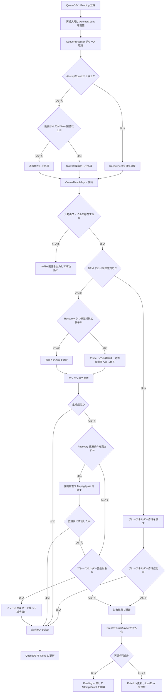

# Flowchart: 動画判定処理・失敗時処理の時系列整理（2026-03-08）

## 1. 目的
- サムネイル作成ジョブが、どの順で判定され、どこで救済され、どこで再試行または最終失敗になるかを時系列で整理する。
- 対象は主に自動サムネイル作成の現行実装である。

## 2. この図に含めるもの
- QueueDB への投入時点の `AttemptCount` 扱い
- リース取得時の `Recovery` / `Slow` 判定
- `ThumbnailCreationService` 内の前処理判定
- 生成失敗後の救済と、キュー層での `Pending` / `Failed` 更新

## 3. この図に含めないもの
- UI の詳細更新手順
- プレビュー画像の細かい保持処理
- ベンチ用の特殊経路

## 4. 時系列まとめ

### 4.1 キュー投入時
1. 動画ごとのジョブは QueueDB へ `Pending` で登録される。
2. 新規登録時の `AttemptCount` は `0`、`LastError` は空で始まる。
3. 同じ動画が再投入された時も、通常は `AttemptCount` を `0` に戻す。
4. ただし `AttemptCount >= 2` の既存行は、`Recovery` 維持のため失敗回数と `LastError` を保持する。

### 4.2 バッチ開始時の判定
1. `ThumbnailQueueProcessor` が `Pending` または期限切れ `Processing` をリースする。
2. 並列数が足り、再試行需要がある時は `AttemptCount >= 1` を先に1件確保し、`Recovery` 枠へ流しやすくする。
3. 並列数が足り、巨大動画需要がある時は `Slow` 対象を先に1件確保する。
4. 残りは通常枠として取得する。
5. 個別ジョブでは `AttemptCount > 0` なら `Recovery` 属性、動画サイズが閾値以上なら `Slow` レーンになる。

### 4.3 生成前の判定
1. `CreateThumbAsync` 開始時に、ハッシュとキャッシュ済みメタ情報を補完する。
2. 手動更新で元サムネイルが無い時は即失敗する。
3. 元動画ファイルが無い時は `noFile` 画像を置いて成功扱いにする。
4. 自動処理で DRM 疑いがある時は、デコーダーへ進まずプレースホルダー画像を作って成功扱いにする。
5. 自動処理で SWF など既知の非対応入力と判定された時も、プレースホルダー作成を優先する。
6. `Recovery` かつインデックス修復対象拡張子なら、生成前に `Probe` して必要時は一時修復動画へ差し替える。
7. 動画尺が未取得なら、メタデータ取得後に必要時だけ Shell フォールバックする。

### 4.4 生成中の失敗救済
1. 選ばれたエンジン順で生成を試す。
2. `autogen` の一時的失敗は、設定回数までその場で再試行する。
3. `autogen` が真っ黒サムネイルを返した時は失敗扱いに直して次候補へ回す。
4. `Recovery` 中で、失敗文言がインデックス破損寄りなら強制修復をかけて再実行する。
5. `Recovery` 中で `autogen` が `no frames decoded` や黒コマ失敗なら、`ffmpeg1pass` を最後の救済として直実行する。
6. 修復後入力でも失敗した時は、元動画に戻して `ffmpeg1pass` を試す場合がある。
7. それでも自動生成が失敗した時は、既知エラーを分類してプレースホルダー画像へ置き換える。
8. ただし初回のインデックス修復対象動画では、失敗を握り潰さず次回 `Recovery` へ送るため、プレースホルダーをあえて作らない。

### 4.5 生成後の確定処理
1. 生成結果が成功なら、QueueDB は `Done` へ更新される。
2. 生成結果が失敗なら、`MainWindow.CreateThumbAsync` が例外化してキュー層へ返す。
3. キュー層では、次の条件で `Pending` へ戻すか `Failed` にするかを決める。
4. `AttemptCount + 1 < 5` かつ元動画が存在する場合は再試行可能として `Pending` へ戻す。
5. この時だけ `AttemptCount` を 1 増やし、`LastError` を保存する。
6. 5回目相当の失敗に達した時、または元動画が消えている時は `Failed` にする。
7. `Failed` へ落とす時は `AttemptCount` を増やさず、その時点の `LastError` だけ更新する。
8. 自動処理で失敗した時は、再スキャン時の誤再投入を避けるためエラーマーカーも出力する。

## 5. フロー図

## 6. 補足ポイント
- `Recovery` はサイズレーンではなく、`AttemptCount > 0` で付く再試行属性である。
- 初回失敗のインデックス修復対象動画は、プレースホルダー成功で握り潰さず、次回 `Recovery` に回す設計になっている。
- `Failed` 化の判定は `AttemptCount + 1 >= 5` だが、`Failed` 更新時は `AttemptCount` 自体は増やさない。

## 7. 主な対応コード
- `src/IndigoMovieManager.Thumbnail.Queue/QueueDb/QueueDbService.cs`
- `src/IndigoMovieManager.Thumbnail.Queue/ThumbnailQueueProcessor.cs`
- `src/IndigoMovieManager.Thumbnail.Queue/ThumbnailLaneClassifier.cs`
- `Thumbnail/MainWindow.ThumbnailCreation.cs`
- `Thumbnail/ThumbnailCreationService.cs`
