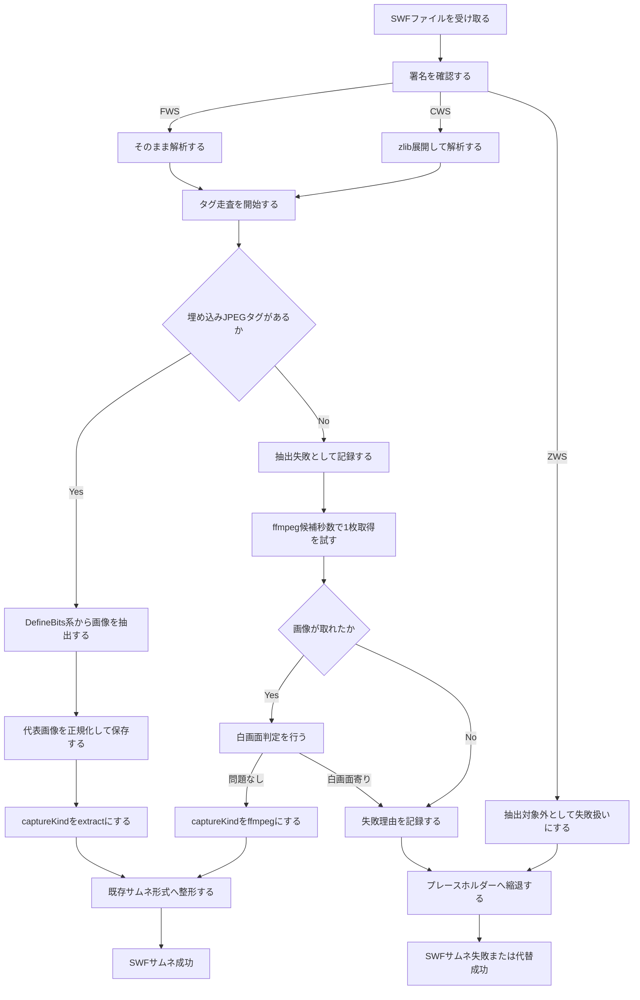

# SWF検証フロー図（2026-03-08）

## 図の範囲
- SWF入力
- `FWS` / `CWS` / `ZWS` の署名判定
- 埋め込み画像抽出
- `ffmpeg` 縮退
- サムネイル成功と失敗の分岐

## 図に含めないもの
- `ZWS` のLZMA展開
- `DefineBitsLossless` 系の復元
- `DefineShape` 系の自前レンダリング
- ActionScript 実行を伴う完全再現

## 実運用メモ
- `FWS` と `CWS` は抽出前提テストを用意済み
- `ZWS` は未対応署名として判定し、抽出失敗から縮退経路へ進む
- `D:\BentchItem_HDD` の既知8本では、直接抽出成功は `0/8`
- 同フォルダでは `ffmpeg` 経路で `dora.swf` と `nightmare.swf` の取得を確認済み
