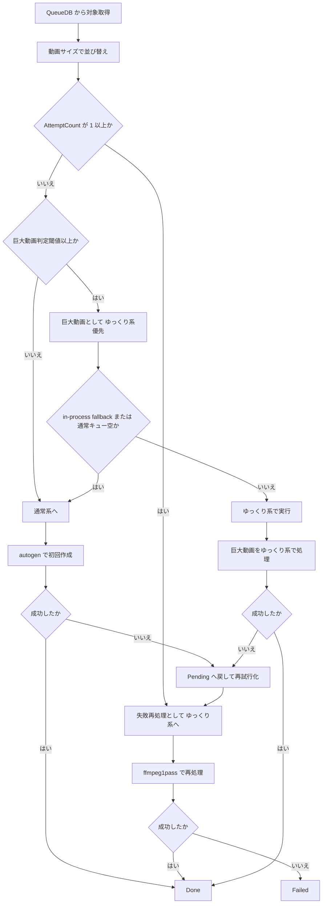

# 仕様書: サムネイル並列方式再設計（2026-03-08）

## 1. 目的
- `ffmpeg.exe` の長時間処理で通常系全体が詰まる現状を解消する。
- サムネイル生成を「通常系」と「ゆっくり系」に責務分離し、巨大動画と失敗再処理を通常系から隔離する。
- 設定UIと進捗UIを、新しい並列方式に合わせて整理する。

## 2. 参照
- 現状整理:
  - `Thumbnail/Flowchart_動画判定処理_失敗時処理_時系列整理_2026-03-08.md`
- 既存プリセット仕様:
  - `Thumbnail/仕様書_サムネイルスレッドプリセット設計_2026-03-06.md`
- 再構築計画向け成果要約:
  - `Thumbnail/連絡用doc_サムネイルスレッド再構築計画向け_別ツリー成果要約_2026-03-11.md`
- 再構築計画向け優先順位:
  - `Thumbnail/優先順位表_サムネイルスレッド再構築計画向け_難読動画論点_2026-03-11.md`

## 3. この仕様に含めるもの
- キューの振り分け規則
- 通常系とゆっくり系の実行責務
- `autogen` と `ffmpeg.exe` の役割分担
- スレッド優先度方針
- 設定項目とUI配置

## 4. この仕様に含めないもの
- DBスキーマ変更詳細
- ベンチ手順
- 将来の外部ワーカープロセス完全分離設計

## 4.1 現コードとの差分を踏まえた再方針
- この仕様は 2026-03-09 時点の再検討版とする。
- ここで定める方針:
  - `再試行専` という名称は廃止する
  - バッチ制御ベースの混在運用はやめ、通常系とゆっくり系へ完全振り分けする
  - 巨大動画でも初回は原則 `autogen` を使う
  - `ffmpeg.exe` は失敗再処理と特殊経路に限定する
  - 巨大動画の通常系代行は `in-process fallback (WorkerRole.All)` 時と、通常キューが空の時だけ許容する
- 現コードとの差分として残る論点:
  - progress UI とテストには `再試行専` 表示がまだ残っている
  - 外部 Worker モードでは巨大動画の通常系代行条件がまだ狭い
  - `ffmpeg1pass` の救済分岐は現時点では一部広めに残っている

## 5. 背景と現状問題
- 現状はバッチ制御の中で、通常動画、巨大動画、失敗再試行、`ffmpeg.exe` フォールバックが混在している。
- このため、`ffmpeg.exe` が長引くと通常系の回転が落ち、小さい動画の処理まで詰まりやすい。
- とくに「初回の `autogen` 失敗後、その場で重い救済へ入る」流れが、通常バッチ停滞の主因になる。

## 6. 再設計の要点

### 6.1 基本方針
- 初回作成は必ず `autogen` を先に試す。
- 巨大動画でも、初回は原則 `autogen` を先に試す。
- 初回失敗時は、その場で重い `ffmpeg.exe` フォールバックへ進めず、失敗再処理キューへ回す。
- 巨大動画と失敗再処理は、通常系とは別の「ゆっくり系」へ完全振り分けする。
- `ffmpeg.exe` は失敗再処理と特殊経路だけで使う。

### 6.1.1 別ツリー成果の先行反映ポイント
- 先に再構築計画へ返すべき成果は次の 3 系統。
  - `35967型`
  - `画像1枚あり顔` 型
  - `repair/remux 先頭救出` 型
- これらは通常系に重い救済を残さず、ゆっくり系へ移送する代表条件として扱う。

### 6.1.2 先に入れない論点
- true near-black 固定群
- `画像1枚ありページ.mkv`
- `【ライブ配信】神回scale_2x_prob-3.mp4`
- bitrate 閾値の決め打ち

### 6.2 レーン構成
- ゆっくり系:
  - 巨大動画
  - 失敗再処理
  - `ffmpeg.exe` 実行
- 通常系:
  - 初回 `autogen` 作成
  - 通常動画の処理

補足:
- 進捗表示の名称は `ゆっくり` と `通常` に統一し、`再試行専` は使わない。

### 6.3 キュー振り分け
- キュー取得時は動画サイズでソートする。
- 通常系には、未再試行ジョブのうち小さい動画を優先して流す。
- ゆっくり系には、巨大動画判定閾値以上の動画を優先して流す。
- 失敗再処理ジョブは、通常系へ戻さずゆっくり系へ固定する。
- 巨大動画の通常系代行は、`in-process fallback (WorkerRole.All)` の時と、通常キューが空の時だけ許容する。

実装補足:
- 完全振り分けを原則とし、通常動画と巨大動画を同一バッチ内で混ぜて帳尻合わせしない。
- 代行条件の「通常キューが空」とは、通常系へ流すべき未再試行・巨大動画未満ジョブが無い状態を指す。
- 再試行ジョブは常にゆっくり系へ固定する。

## 7. 実行ルール

### 7.1 初回作成
- 対象:
  - `AttemptCount = 0`
- 実行エンジン:
  - `autogen`
- 成功時:
  - `Done`
- 失敗時:
  - `Pending` へ戻し、再試行カウントを増やしてゆっくり系対象にする

補足:
- 巨大動画でも初回はこのルールに従う。

### 7.2 失敗再処理
- 対象:
  - `AttemptCount が 1 以上`
- 実行系:
  - ゆっくり系
- 実行エンジン:
  - `ffmpeg1pass` を主経路とする
- 目的:
  - 通常系を止めずに、重い救済処理だけを別枠で回す

補足:
- 既定運用では retry job は `ThumbnailEngineRouter` で `ffmpeg1pass` を直接選ぶ。
- `ffmpeg.exe` は「失敗したから使う」「特殊条件だから使う」に限定する。

### 7.3 巨大動画処理
- 対象:
  - `巨大動画判定GB閾値` 以上
- 優先実行系:
  - ゆっくり系
- 初回実行エンジン:
  - `autogen`
- 例外:
  - `in-process fallback (WorkerRole.All)` の時
  - 通常キューが空の時

## 8. 並列数と先読み方針

### 8.1 ゆっくり系
- 先読みキュー:
  - 1件
- 主用途:
  - 巨大動画
  - 失敗再処理
- 想定ワーカー:
  - 外部 Worker では `idle` プロセス `1` 本
  - 進捗表示上は `ゆっくり` として扱う

### 8.2 通常系
- 先読みキュー:
  - 外部 Worker では `max(4, resolvedParallelism)` 件
- 主用途:
  - 初回 `autogen`
  - 通常動画を小さい順で処理
  - 条件付きの巨大動画代行
- 想定ワーカー:
  - 外部 Worker では `normal` プロセス `1` 本 + 内部並列 `configured - 1`
  - 進捗表示上は `通常 1 ... 通常 n`

### 8.3 現在の進捗表示ルール
- `1`:
  - `ゆっくり`
- `2-max`:
  - `通常 n`

補足:
- 上記は進捗UI上の仮想 workerId であり、実プロセス数ではない。

## 9. 優先度方針

### 9.1 ゆっくり系
- Windows優先度:
  - `Idle` 相当を基本とする
- 適用対象:
  - 巨大動画の初回 `autogen`
  - 失敗再処理
  - `ffmpeg.exe`

### 9.2 通常系
- Windows優先度:
  - `BelowNormal`
- 適用対象:
  - 初回 `autogen`
  - 通常動画処理

### 9.3 固定方針
- 優先度は動的に揺らさず、系統ごとに固定する。
- `ffmpeg.exe` は必ず通常系より低い優先度で動かす。

## 10. 設定値

### 10.1 必須設定
- プリセット
- 巨大動画判定GB閾値
- GPU使用可否
- 並列作成数
- サムネイルを縮小する

### 10.2 巨大動画判定GB閾値
- 役割:
  - これ以上のサイズを、基本的にゆっくり系へ送る
- 例外:
  - `in-process fallback (WorkerRole.All)` に入っている時
  - 通常キューが空の時

### 10.3 GPU使用可否
- 必ず `OFF` にできること
- 想定:
  - ゲームや他作業と並行したい利用者

## 11. プリセット方針
- 既存の「サムネイル負荷プリセット」と「閾値プリセット」は統合する。
- 表示名は `プリセット` 一本化とする。
- `custom` 以外は、並列数と巨大動画判定閾値の両方を同時に解決する。
- `custom` のみ、個別値を直接編集できる。
- 旧 `優先レーン上限サイズ(MB)` は廃止する。

## 12. UI要件

### 12.1 タブ名称
- `サムネイル進捗` タブは `サムネイル` タブへ改名する。

### 12.2 廃止する表示
- CPUメーター
- GPUメーター
- HDDメーター

### 12.3 タブ側でも操作できる項目
- サムネイルを縮小する
- GPUデコードを使う
- 並列作成数

補足:
- 2026-03-08 時点では `CommonSettingsWindow` 側にも同系統設定が残っている。
- 現状は「完全移設」ではなく「タブ側からも即時操作できる重複配置」とみなす。

### 12.4 タブ側に表示する項目
- プリセット
- 巨大動画判定GB閾値
- サムネイルを縮小する
- GPUデコードを使う
- 並列作成数
- 現在の実効並列数
- レーン説明

### 12.5 レーン説明文
- ゆっくり:
  - 巨大動画・失敗再処理
- 通常:
  - 小さい動画を優先処理
  - ただし通常キューが空なら巨大動画代行あり

### 12.6 下部タブ要約
- 下部 `サムネイル` タブは、重い詳細表示を持たず要約だけを表示する。
- 要約は次の3系統を1画面で確認できること。
  - viewer状態
  - progress状態
  - worker health状態
- 3系統は1つの長文ではなく、行単位で独立表示すること。
  - viewer状態行
  - progress状態行
  - worker health状態行
- 異常がある時だけ強調表示すること。
  - progress の `failed > 0`
  - health の `missing / start-failed / exited`
  - health の `dll-missing / db-mismatch / process-start-failed / exception`
- 強調は行単位で行い、正常行まで赤くしないこと。
- 例:
  - `別窓ビューアー稼働中: 詳細パネルは別ウィンドウ側で更新しています。`
  - `進捗: 稼働=1 / 待機=3 / 失敗=0 / 完了=2`
  - `Worker: 通常:稼働(BelowNormal) / ゆっくり:待機(Idle)`

## 12.7 外部状態契約
- UI と Viewer は Worker 内部メモリを直接読まない。
- 進捗は `thumbnail-progress-*.json` を正とする。
- health は `thumbnail-health-*.json` を正とする。

### progress snapshot
- `SchemaVersion`
- `Version`
- `SessionCompletedCount`
- `SessionTotalCount`
- `CurrentParallelism`
- `ConfiguredParallelism`
- `EnqueueLogs`
- `ActiveWorkers`
- `WaitingWorkers`

### progress worker item
- `WorkerId`
- `WorkerLabel`
- `WorkerRole`
- `State`
- `MainDbFullPath`
- `OwnerInstanceId`
- `DisplayMovieName`
- `MovieFullPath`
- `PreviewImagePath`
- `PreviewCacheKey`
- `PreviewRevision`
- `IsActive`
- `UpdatedAtUtc`

### progress state
- `waiting`
- `started`
- `saved`
- `completed`
- `failed`

### health snapshot
- `SchemaVersion`
- `WorkerRole`
- `OwnerInstanceId`
- `MainDbFullPath`
- `State`
- `ReasonCode`
- `SettingsVersionToken`
- `CurrentPriority`
- `Message`
- `ProcessId`
- `ExitCode`
- `UpdatedAtUtc`
- `LastHeartbeatUtc`

### health reason
- `worker-missing`
- `process-start-failed`
- `db-mismatch`
- `dll-missing`
- `exception`
- `graceful-stop`
- `canceled`

## 13. ログ要件
- 初回 `autogen` 失敗で再試行キューへ送ったことを記録する。
- ゆっくり系へ振り分けた理由を記録する。
  - 巨大動画
  - 失敗再処理
- `ffmpeg.exe` 実行開始時に、優先度と対象理由を記録する。
- 通常系が巨大動画を代行した時は、その理由を記録する。
- `ffmpeg.exe` を使わず `autogen` で巨大動画初回を処理したことも区別して記録する。

## 14. 期待効果
- 小さい動画の回転を維持しやすくなる。
- `ffmpeg.exe` 長時間処理の影響を通常系へ広げにくくなる。
- 失敗再処理の責務が分かれ、挙動の説明がしやすくなる。
- UI上でも「通常」と「ゆっくり」の意味が利用者に伝わりやすくなる。

## 15. フロー図

## 16. 再検討後の残課題
- 外部 Worker モードでも「通常キュー空なら巨大動画代行」をどう実装するかを決める。
- `CommonSettingsWindow` と `サムネイル` タブの重複設定を整理し、最終的な正規UIを一本化する。
- `再試行専` 表示を progress UI とテストからどう外すかを決める。
- retry job に残っている forced engine / repair 後 onepass 例外経路を、正式仕様として残すか縮退させるかを決める。
- Worker telemetry と manual check を続け、`BelowNormal` / `Idle` の体感差を実機で確定する。

状況:
- キュー分離、Worker 分離、外部 progress / health snapshot 化までは反映済みである。
- いま残っているのは「実装差分の整理」と「運用仕様として残す例外経路の確定」である。
