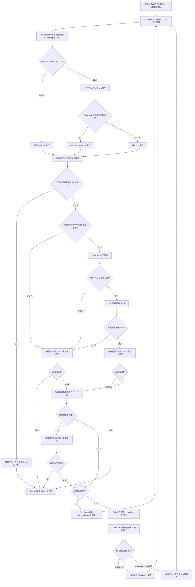

# 現状把握: サムネ失敗動画のリカバリーフロー 2026-03-09

## 1. 目的
- 2026-03-09 時点の「サムネイル生成失敗動画の救済経路」を、コード実装ベースで現状把握用に整理する。
- 自動回復と手動回復の境界を明確にする。
- 今後のエンジン分離で残すべき責務を見える化する。

## 2. この文書の対象
- Queue に入ったサムネイル生成ジョブの失敗後リカバリー
- `Recovery` レーン
- インデックス修復
- 既知失敗の代替サムネイル
- 最終失敗固定
- `Failed -> Pending` の手動再投入
- missing thumbnail の再投入

## 3. この文書の対象外
- 新規動画検出の細かな watcher 差分計算
- 手動キャプチャ位置指定の個別UI操作
- サムネイル成功時の通常保存フロー詳細

## 4. 現状の要点
1. 初回失敗で即終了ではなく、再試行可能なものは `Pending` に戻して再実行する。
2. `AttemptCount > 0` のジョブは `Recovery` 属性を持ち、通常処理とは別に優先制御される。
3. `Recovery` では、対象拡張子に対して index probe と一時修復動画での再実行を試す。
4. 既知の非対応や保護コンテンツ疑いは、実フレーム抽出ではなく代替サムネイルで確定させる。
5. 回復不能な失敗は `Failed` と `.#ERROR.jpg` で固定化し、無限再試行を防ぐ。
6. `.#ERROR.jpg` は途中失敗では置かず、最終失敗（5回目相当）でだけ配置する。
7. 再試行中や成功時は、既存の `.#ERROR.jpg` を削除して再スキャンを妨げない。
8. 固定後の再挑戦は、手動の `Failed -> Pending` 戻し、または missing thumbnail 救済で行う。
9. 停止キャンセル時は `Processing` を放置せず、`AttemptCount` を増やさず `Pending` へ戻して lease を外す。

## 5. 現状フロー図

## 6. フローの読み方

### 6.1 Queue と再試行
- Queue の基本状態は `Pending / Processing / Done / Failed` で回る。
- 失敗時は `ThumbnailQueueProcessor` が再試行可否を判定し、再試行可能なら `Pending` へ戻す。
- 最大試行回数は `5` で、上限到達時は `Failed` へ送る。
- 停止キャンセル時は失敗扱いにせず、`AttemptCount` を維持したまま `Pending` へ戻す。

### 6.2 Recovery レーン
- `AttemptCount > 0` の再試行ジョブだけが `Recovery` 扱いになる。
- 並列数に余裕がある時は、通常ジョブを止めすぎないよう `Recovery` 用の実行枠を確保する。
- これにより、難しい動画の再試行と通常動画の処理を分離している。

### 6.3 index 修復
- `Recovery` かつ修復対象拡張子の時だけ、生成前に `Probe` を実行する。
- index 異常が見つかった場合は、一時ファイルへ remux ベースの修復を行い、その修復動画でサムネイル生成を再実行する。
- 生成失敗後にも、条件に合えば強制修復をもう一度試す。

### 6.4 既知失敗の代替サムネイル
- DRM 疑い、非対応コーデック、SWF シグネチャのような「通常抽出で救いにくい既知系」は、実フレーム抽出ではなく代替サムネイルを生成して確定させる。
- ここは「失敗を減らす」のではなく、「失敗扱いにせず表示を確定させる」役割である。

### 6.5 最終失敗固定
- 再試行上限に達したもの、または回復不能と判断されたものは `Failed` に更新する。
- あわせて最終失敗時だけ `.#ERROR.jpg` を置き、watcher や再走査で同じ失敗を無駄に繰り返さないようにする。
- 再試行中や成功時は stale な `.#ERROR.jpg` を削除し、途中段階では自動再投入の妨げにしない。
- 停止キャンセルは最終失敗固定へ進めず、lease を外して `Pending` へ戻す。

### 6.6 手動回復と missing thumbnail 救済
- `Failed` に入ったジョブは、運用上 `ResetFailedThumbnailJobsForCurrentDb()` または SQL で `Pending` に戻せる。
- サムネイル jpg が欠損した場合は watcher 側の missing thumbnail 救済で再投入できる。
- つまり「自動回復で救えなかった後」にも、再挑戦の入口は残っている。

## 7. 自動回復と手動回復の境界

| 区分 | 入口 | 主担当 | 目的 |
|---|---|---|---|
| 自動回復 | Queue 実行中の失敗 | QueueProcessor, RepairCoordinator | 再試行と修復で救済する |
| 自動確定 | 既知の非対応判定 | Thumbnail 生成側 | 代替サムネイルで表示を確定する |
| 自動固定 | 再試行上限到達 | QueueProcessor, FailureFinalizer | `Failed` と `.#ERROR.jpg` で固定化する |
| 手動回復 | 運用者の再試行指示 | MainWindow, QueueDb | `Failed -> Pending` に戻す |
| 欠損救済 | サムネイル jpg 欠落 | Watcher | 生成済み動画のサムネイル欠損を補う |

## 8. 現状の評価
- 再試行、修復、代替サムネイル、失敗固定、手動再投入まで一通り揃っている。
- 失敗理由ごとの分岐は機能しているが、判断責務は `Queue / Repair / 代替サムネ / Watcher` に分散している。
- `.#ERROR.jpg` の配置タイミングは「最終失敗だけ」に寄せ、途中失敗での固定化を避けるよう 2026-03-09 に調整した。
- 停止キャンセル時に `Processing` が取り残される欠陥は、2026-03-09 に `Pending` 復元へ修正した。
- 現状把握としては十分だが、今後の分離計画では「失敗分類」と「回復方針決定」をエンジン側へさらに寄せる余地がある。

## 9. 確認元
- [ThumbnailQueueProcessor.cs](/c:/Users/{username}/source/repos/IndigoMovieManager_fork/src/IndigoMovieManager.Thumbnail.Queue/ThumbnailQueueProcessor.cs)
- [QueueDbService.cs](/c:/Users/{username}/source/repos/IndigoMovieManager_fork/src/IndigoMovieManager.Thumbnail.Queue/QueueDb/QueueDbService.cs)
- [ThumbnailRepairWorkflowCoordinator.cs](/c:/Users/{username}/source/repos/IndigoMovieManager_fork/Thumbnail/ThumbnailRepairWorkflowCoordinator.cs)
- [ThumbnailFailureFinalizer.cs](/c:/Users/{username}/source/repos/IndigoMovieManager_fork/Thumbnail/ThumbnailFailureFinalizer.cs)
- [MainWindow.Watcher.cs](/c:/Users/{username}/source/repos/IndigoMovieManager_fork/Watcher/MainWindow.Watcher.cs)
- [サムネイルが作成できない動画対策.md](/c:/Users/{username}/source/repos/IndigoMovieManager_fork/Thumbnail/サムネイルが作成できない動画対策.md)
- [Flowchart_サムネイル処理ワークフロー_Recovery詳細_2026-03-08.md](/c:/Users/{username}/source/repos/IndigoMovieManager_fork/Thumbnail/Flowchart_サムネイル処理ワークフロー_Recovery詳細_2026-03-08.md)
- [手動再試行運用手順.md](/c:/Users/{username}/source/repos/IndigoMovieManager_fork/Thumbnail/手動再試行運用手順.md)
