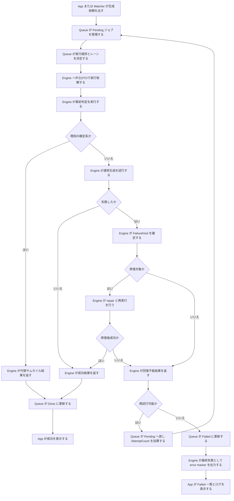

# 設計メモ: エンジン分離後のサムネ失敗リカバリー責務配置図 2026-03-09

## 1. 目的
- サムネ失敗動画のリカバリー責務を、エンジン分離後にどの層へ置くべきか整理する。
- 現状把握文書を踏まえ、`App / Queue / Engine / Watcher` の境界を明確にする。
- DCO に反しない形で、今後の実装移管先を固定する。

## 2. 前提
- UI 型は `Engine / Queue` に持ち込まない。
- 回復方針の決定は UI ではなく Engine 側へ寄せる。
- Queue は「実行順序と再試行管理」、Engine は「失敗分類と生成結果決定」に集中させる。
- Watcher は新規検出と欠損救済の入口に限定する。

## 3. 責務配置の結論

| 層 | 持つ責務 | 持たない責務 |
|---|---|---|
| App | UI表示、手動再試行指示、進捗反映 | 失敗分類、修復条件判定 |
| Watcher | 新規動画検出、missing thumbnail 再投入 | サムネ失敗の救済判定本体、途中失敗の固定化 |
| Queue | `Pending/Done/Failed` 管理、AttemptCount、Lease、Recovery レーン制御 | コーデック判定、DRM 判定、修復要否判定 |
| Engine | 事前判定、失敗分類、代替サムネ、index repair、実尺probeによる時刻補正、最終結果決定、最終失敗時の error marker 出力 | UI更新、QueueDB 直接更新 |

## 4. 分離後の責務フロー図

## 5. 実装配置の指針

### 5.1 App
- `MainWindow.*` は再試行ボタン、失敗一覧、進捗表示だけに残す。
- `FailureKind` を見て文言を変えることはよいが、分類ロジック自体は持たない。

### 5.2 Queue
- `ThumbnailQueueProcessor` は `AttemptCount`、`Lease`、`Recovery` レーン、`Done/Failed` 遷移だけを担当する。
- Queue が知るべきなのは `retryable`、`final`、`placeholder success` の結果区分だけでよい。
- 失敗文字列の解釈やヘッダ判定は Queue へ入れない。
- 途中失敗では `.#ERROR.jpg` を置かず、`Failed` 確定時だけ Engine 側の finalizer を呼ぶ前提にする。

### 5.3 Engine
- `ThumbnailPreflightChecker` がヘッダ判定と事前プレースホルダー化を担当する。
- `ThumbnailRepairWorkflowCoordinator` が index repair を担当する。
- `ThumbnailPlaceholderUtility` が代替サムネイルを担当する。
- `ThumbnailExecutionPolicy` が `FailureKind` ごとの回復方針を決める中心になる。
- `ThumbnailFailureFinalizer` が最終失敗時だけ `.#ERROR.jpg` を置き、再試行中や成功時は stale マーカーを消す。
- `ThumbnailJobMaterialBuilder` が `AVI`/`DIVX` の壊れた duration を `FFMediaToolkit` / `OpenCV` で再取得し、`BuildAutoThumbInfo` 前に seek 秒数を補正する。

### 5.4 Watcher
- `missing thumbnail` と `新規動画` の入口だけを維持する。
- サムネ失敗理由による分岐は持たず、`.#ERROR.jpg` が無い欠損だけを Queue へ再投入する入口に留める。

## 6. 現状コードとの対応

| 役割 | 現在の主実装 |
|---|---|
| Queue 実行制御 | [ThumbnailQueueProcessor.cs](/c:/Users/na6ce/source/repos/IndigoMovieManager_fork/src/IndigoMovieManager.Thumbnail.Queue/ThumbnailQueueProcessor.cs) |
| Queue 状態保持 | [QueueDbService.cs](/c:/Users/na6ce/source/repos/IndigoMovieManager_fork/src/IndigoMovieManager.Thumbnail.Queue/QueueDb/QueueDbService.cs) |
| 実行Facade | [ThumbnailCreationRuntime.cs](/c:/Users/na6ce/source/repos/IndigoMovieManager_fork/Thumbnail/ThumbnailCreationRuntime.cs) |
| 実処理の窓口 | [ThumbnailCreationFacade.cs](/c:/Users/na6ce/source/repos/IndigoMovieManager_fork/Thumbnail/ThumbnailCreationFacade.cs) |
| 事前判定 | [ThumbnailPreflightChecker.cs](/c:/Users/na6ce/source/repos/IndigoMovieManager_fork/Thumbnail/ThumbnailPreflightChecker.cs) |
| 失敗時プレースホルダー | [ThumbnailPlaceholderUtility.cs](/c:/Users/na6ce/source/repos/IndigoMovieManager_fork/Thumbnail/ThumbnailPlaceholderUtility.cs) |
| 修復ワークフロー | [ThumbnailRepairWorkflowCoordinator.cs](/c:/Users/na6ce/source/repos/IndigoMovieManager_fork/Thumbnail/ThumbnailRepairWorkflowCoordinator.cs) |
| 最終失敗固定 | [ThumbnailFailureFinalizer.cs](/c:/Users/na6ce/source/repos/IndigoMovieManager_fork/Thumbnail/ThumbnailFailureFinalizer.cs) |
| 欠損救済入口 | [MainWindow.Watcher.cs](/c:/Users/na6ce/source/repos/IndigoMovieManager_fork/Watcher/MainWindow.Watcher.cs) |

## 7. 今後の実装ルール
1. 新しい失敗判定は、まず Engine 側へ追加する。
2. Queue に追加してよいのは、再試行回数と実行順序に関わる情報だけにする。
3. UI 文言追加は App 側で行うが、判定根拠は `FailureKind` など中立値に依存させる。
4. Watcher には「再投入してよいか」の入口判断だけを残し、失敗分類は持たせない。

## 8. 補足
- 現状でも大枠はこの方向に近いが、失敗分類の一部が文字列ベースで分散している。
- 分離を完了させるには、`FailureKind` と `ThumbnailExecutionDecision` のような中立DTOを固定するのが次の一手である。
- 2026-03-09 の調整で、`.#ERROR.jpg` は「途中失敗の印」ではなく「最終失敗の固定印」に寄せたため、責務境界もその前提で読む必要がある。
- 2026-03-09 の調整で、`AVI` の shell duration 汚染も Engine 側の素材組み立て時点で吸収するようにしたため、時刻補正責務も Engine に寄せて読む。

## 9. 関連文書
- [現状把握_サムネ失敗動画リカバリーフロー_2026-03-09.md](/c:/Users/na6ce/source/repos/IndigoMovieManager_fork/Thumbnail/現状把握_サムネ失敗動画リカバリーフロー_2026-03-09.md)
- [DCO_エンジン分離実装規則_2026-03-05.md](/c:/Users/na6ce/source/repos/IndigoMovieManager_fork/Thumbnail/DCO_エンジン分離実装規則_2026-03-05.md)
