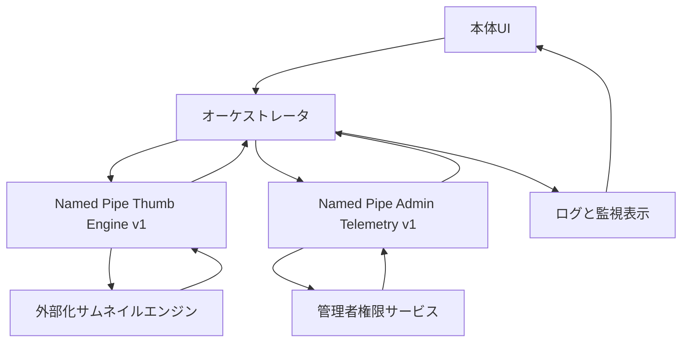

# 設計メモ: サムネイルサービスIPC構成図（2026-03-06）

## 1. 目的
- サムネイル本体、外部化エンジン、管理者権限サービスの責務境界を図で固定する。
- IPC導入後も、並列制御の最終判断がどこにあるかを曖昧にしない。

## 2. 含める範囲
- 本体UI
- オーケストレータ
- 外部化サムネイルエンジン
- 管理者権限サービス
- ログ/UI表示層

## 3. 含めない範囲
- DB詳細
- FFmpeg内部処理詳細
- サービスインストーラ詳細

## 4. 構成図

## 5. 採用方式
- IPC方式は Windows ローカル限定の `named pipe` を採用する。
- メッセージ形式は `length-prefixed-json` を採用し、UTF-8 の `System.Text.Json` で直列化する。
- DTOは `src/IndigoMovieManager.Thumbnail.Queue/Ipc/ThumbnailIpcDtos.cs` の `record` / `enum` をそのまま使う。
- pipe名は以下で固定する。
  - 管理者権限サービス: `IndigoMovieManager.AdminTelemetry.v1`
  - サムネイルエンジン: `IndigoMovieManager.Thumbnail.Engine.v1.{instanceId}`

## 6. 接続方針
- オーケストレータを常にIPCクライアントに固定する。
- 外部化サムネイルエンジンと管理者権限サービスを、それぞれIPCサーバーに固定する。
- 管理者権限サービスは単一pipeを常駐公開し、Watcher側の `AdminUsnMft` とサムネイル側のDisk温度取得を同じ昇格経路へ寄せる。
- サムネイルエンジンpipeはオーケストレータ起動インスタンスごとに分け、多重起動時の誤接続を防ぐ。
- 接続ポリシーの固定値は `src/IndigoMovieManager.Thumbnail.Queue/Ipc/ThumbnailIpcTransportPolicy.cs` に置く。
  - `ConnectTimeoutMs = 1000`
  - `RequestTimeoutMs = 2000`
  - `HealthCheckTimeoutMs = 500`
  - `ReconnectDelayMs = 5000`
- ハンドシェイクでは最低限 `protocol version`, `role`, `instance id`, `process id`, `capabilities` を交換する。
- UIとログ表示は同一プロセス内連携を維持し、この段階では別IPCへ切り出さない。

## 7. 方式選定理由
- `named pipe`
  - ローカル専用で十分であり、Windowsサービスとの接続に素直に乗る。
  - `Watcher` 側の Everything IPC と思想が近く、OS前提を崩さない。
  - TCP待受やHTTPポート管理が不要で、ファイアウォールやポート競合を増やさない。
- `gRPC / HTTP`
  - 現段階では大げさで、監視・認証・ポート管理の責務が増える。
- `MemoryMappedFile`
  - ストリーム的な要求応答やタイムアウト制御が面倒で、今回の責務に合わない。

## 8. 通信責務
- `UI -> オーケストレータ`
  - プリセット変更
  - 手動並列数変更
  - 現在状態照会
- `オーケストレータ -> エンジン`
  - ジョブ投入
  - 実行中止
  - 実行ポリシー通知
- `エンジン -> オーケストレータ`
  - `ReportEngineJobMetrics`
  - 実行結果通知
  - エラー詳細通知
- `オーケストレータ -> 管理者権限サービス`
  - `GetSystemLoadSnapshot`
  - `GetDiskThermalSnapshot`
  - `GetUsnMftStatus`
- `管理者権限サービス -> オーケストレータ`
  - 負荷スナップショット返却
  - 権限不足通知
  - 取得失敗通知
- `オーケストレータ -> ログと監視表示`
  - `NotifyThrottleDecision`
  - 現在並列数
  - レーン予約状態

## 9. 責務分離の原則
- UIは見せるだけに留める。
- オーケストレータが並列制御の最終判断を持つ。
- エンジンはジョブ処理と局所メトリクス返却だけを持つ。
- 管理者権限サービスは特権取得だけを持つ。
- ログ層は判断結果を追跡可能にする。

## 10. フォールバック
- 管理者権限サービス未接続:
  - オーケストレータは内部メトリクスのみで高負荷判定する。
- エンジン再起動時:
  - オーケストレータは未完了ジョブを再キューし、既存のプロセス内経路または再接続待ちへ落とす。
- IPCタイムアウト時:
  - オーケストレータは安全側に1段縮退する。

## 11. 注意
- 管理者権限サービスは「縮退を提案する」ための情報源であり、「縮退を決定する」主体ではない。
- エンジン側で勝手に全体並列数を下げない。
