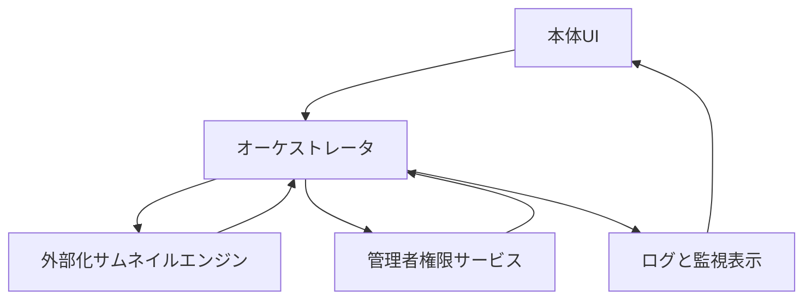

# 設計メモ: サムネイルサービスIPC構成図（2026-03-06）

## 1. 目的
- サムネイル本体、外部化エンジン、管理者権限サービスの責務境界を図で固定する。
- IPC導入後も、並列制御の最終判断がどこにあるかを曖昧にしない。

## 2. 含める範囲
- 本体UI
- オーケストレータ
- 外部化サムネイルエンジン
- 管理者権限サービス
- ログ/UI表示層

## 3. 含めない範囲
- DB詳細
- FFmpeg内部処理詳細
- サービスインストーラ詳細

## 4. 構成図

## 5. 通信責務
- `UI -> オーケストレータ`
  - プリセット変更
  - 手動並列数変更
  - 現在状態照会
- `オーケストレータ -> エンジン`
  - ジョブ投入
  - 実行中止
  - 実行ポリシー通知
- `エンジン -> オーケストレータ`
  - `ReportEngineJobMetrics`
  - 実行結果通知
  - エラー詳細通知
- `オーケストレータ -> 管理者権限サービス`
  - `GetSystemLoadSnapshot`
  - `GetDiskThermalSnapshot`
  - `GetUsnMftStatus`
- `管理者権限サービス -> オーケストレータ`
  - 負荷スナップショット返却
  - 権限不足通知
  - 取得失敗通知
- `オーケストレータ -> ログと監視表示`
  - `NotifyThrottleDecision`
  - 現在並列数
  - レーン予約状態

## 6. 責務分離の原則
- UIは見せるだけに留める。
- オーケストレータが並列制御の最終判断を持つ。
- エンジンはジョブ処理と局所メトリクス返却だけを持つ。
- 管理者権限サービスは特権取得だけを持つ。
- ログ層は判断結果を追跡可能にする。

## 7. フォールバック
- 管理者権限サービス未接続:
  - オーケストレータは内部メトリクスのみで高負荷判定する。
- エンジン再起動時:
  - オーケストレータは未完了ジョブを再キューする。
- IPCタイムアウト時:
  - オーケストレータは安全側に1段縮退する。

## 8. 注意
- 管理者権限サービスは「縮退を提案する」ための情報源であり、「縮退を決定する」主体ではない。
- エンジン側で勝手に全体並列数を下げない。
