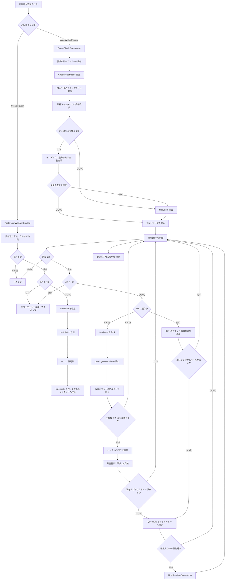

# Flowchart: 新動画追加処理の時系列整理（2026-03-08）

## 1. 目的
- 新しい動画ファイルが追加された時に、どの入口から検知され、どうDB登録され、どうサムネイルキューへ流れるかを時系列で整理する。
- 対象は現行の `FileSystemWatcher` 即時経路と、`CheckFolderAsync` による再走査経路である。

## 2. この図に含めるもの
- `Created` イベントの即時登録経路
- `Auto` / `Watch` / `Manual` の再走査経路
- Everything優先走査と filesystem fallback
- `MovieInfo` 作成、MainDB登録、UI反映、サムネイルキュー投入

## 3. この図に含めないもの
- 削除時の処理
- リネーム時の処理
- サムネイル作成後の失敗救済

## 4. 時系列まとめ

### 4.1 入口は2系統ある
1. 監視対象フォルダで `FileSystemWatcher.Created` が発火した時は、即時経路で処理する。
2. 起動時の `Auto`、Everythingポーリングの `Watch`、手動更新の `Manual` は、`QueueCheckFolderAsync` から再走査経路へ入る。
3. 再走査要求は単純に多重実行せず、`Manual > Watch > Auto` の優先順位で1本へ圧縮する。

### 4.2 `Created` イベントの即時経路
1. 拡張子が監視対象かを確認する。
2. コピー中の可能性があるため、最大10回まで読み取り可能になるのを待つ。
3. ファイル長が読めない時はスキップする。
4. 0バイト動画はエラーマーカーを作ってスキップする。
5. `new MovieInfo(path)` でメタ情報とハッシュを取得する。
6. MainDB の `movie` テーブルへ登録する。
7. 対象動画1件だけをUI一覧へ追加する。
8. `QueueObj` を作り、現在タブ向けサムネイル作成キューへ投入する。

### 4.3 再走査の準備
1. `CheckFolderAsync` 開始時に、DBパス、サムネイルフォルダ、DB名、現在タブをスナップショットする。
2. 既存サムネイル一覧を先に集める。
3. 既存 `movie` テーブルも辞書化して、以降の存在確認を高速化する。
4. 画面ソース上の動画パス一覧と、実際に表示中の一覧も別で保持する。
5. 監視設定テーブル `watch` を、モード別条件で読み込む。

### 4.4 フォルダごとの候補抽出
1. 各監視フォルダについて、Everything対象ならインデックス経路を先に試す。
2. `Watch` モードでは前回同期時刻以降だけを差分取得する。
3. `Auto` と `Manual` の全量走査で Everything が 0 件なら、取りこぼし防止のため filesystem 走査へフォールバックする。
4. `Watch` で差分0件が続く場合だけ、低頻度で全量再突合を許可する。
5. 使う走査経路が決まったら、新規候補パス一覧を得る。

### 4.5 候補1件ごとの判定
1. まず実ファイル長を確認し、読めない動画はスキップする。
2. 0バイト動画はエラーマーカーを作ってスキップする。
3. `movie_path` で既存DB辞書を引き、DB既存か未登録かを判定する。

### 4.6 DB未登録だった時
1. `MovieInfo` をバックグラウンドで作る。
2. 作成した `MovieInfo` は、その場で1件ずつINSERTせず `pendingNewMovies` に積む。
3. UIにはまず仮表示プレースホルダーを置く。
4. 小規模件数時、または100件たまった時点で `InsertMovieTableBatch` へまとめて流す。
5. バッチINSERT後に採番済み `MovieId` と `Hash` を辞書へ反映する。
6. 小規模件数時は対象動画だけUIへ正式追加する。
7. 現在タブの想定サムネイルが無ければ、`QueueObj` を作ってサムネイルキューへ積む。

### 4.7 既にDB登録済みだった時
1. 画面ソースに未反映なら、既存DB行としてUIだけ補正する。
2. 表示一覧に未反映なら、再描画対象として扱う。
3. 現在タブの想定サムネイルパスを `fileBody + hash` で組み立てる。
4. そのサムネイルが既に存在するならキュー投入しない。
5. 存在しない時だけ、既存 `MovieId` と `Hash` を使ってサムネイルキューへ積む。

### 4.8 キュー投入の仕方
1. サムネイルキュー投入は即時直列ではなく、フォルダ単位バッファへ積む。
2. 小規模件数時は1件ごとに即投入する。
3. 大規模件数時は100件単位で `FlushPendingQueueItems` する。
4. 走査終了時に端数バッファも必ず流し切る。

## 5. フロー図

## 6. 補足ポイント
- `Created` イベント経路は1件即時処理、`CheckFolderAsync` 経路はまとめ処理という違いがある。
- 再走査経路では、DB未登録動画でもすぐINSERTせず、`MovieInfo` 作成後にバッチ登録する。
- `Watch` 差分0件は正常系なので、その場では filesystem fallback しない。低頻度の全量再突合で取りこぼしを補正する。
- サムネイルの有無判定は「現在タブの出力先に、`{fileBody}.#{hash}.jpg` があるか」で行う。

## 7. 主な対応コード
- `Watcher/MainWindow.Watcher.cs`
- `Watcher/EverythingFolderSyncService.cs`
- `Models/MovieInfo.cs`
